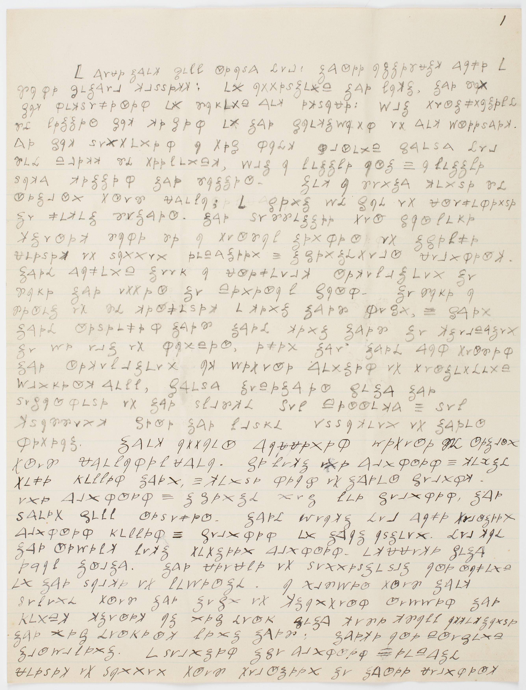

tags:: [[cipher]][[communication]][[history]][[writing]][[dooley]]
projects:[[]]

### Reference 
> [!info]
> - **Cite Key:** [[1-inbox/@dooleyIntroductionRevolutionaryCipher2018]]
> - **Link:** [Dooley - 2018 - Introduction – A Revolutionary Cipher.pdf](file://C:\Users\regsg\Zotero\storage\B5SQQ79V\Dooley%20-%202018%20-%20Introduction%20–%20A%20Revolutionary%20Cipher.pdf)
> - **Abstract:** Cryptology is the science of secret writing. It is made up of two halves; cryptography consists of the techniques for creating systems of secret writing and cryptanalysis encompasses the techniques of breaking them. Over the past 2500 years, cryptology has developed numerous types of systems to hide messages and subsequently a rich vocabulary in which to describe them. In this chapter we introduce the reader to the vocabulary of cryptology, explain the differences between codes and ciphers and begin the discussion of how to decipher an unknown message.
Use the zotero integration: full reference command to add the bibliographic metadata. In the metadata block above, use the cite key (start typing @ and the surname you're after to get that correct) . Change the title of the note to the cite key, including the @ sign.

---

### Summary & Key Take Aways

	In Introduction - A Revolutionary Cipher, Dooley discusses the basic history of secret code, in addition to how these messages could be uncovered. The author begins with the story of Mary Butler's ciphered message from her lover, highlighting the use of ciphers for revolutionary purposes. Ciphers had been used for about 3000 years, providing a sense of security in communication amongst friends, family, and allies. Dooley then introduces the main topic of his article, wherein he covers the basics of encryption and decryption.
	 After this, the author explains various important definitions of types of encryption, ensuring the reader will be able to understand the terms used in future chapters. Once the main methods of encryption are solidified, Dooley discusses various methods of decrypting secret codes and ciphers, providing an insight into how militaries would decipher messages from the enemy. This chapter is a basic insight into ciphers and their history, creating the perfect pathway for Dooley to elaborate further throughout his piece.

*Dr Benjamin Church's cipher, 1775 (below)

--- 

### Links
[Privacy in Dooley's Introduction - Revolutionary Cipher](Privacy%20in%20Dooley's%20Introduction%20-%20Revolutionary%20Cipher.md)
