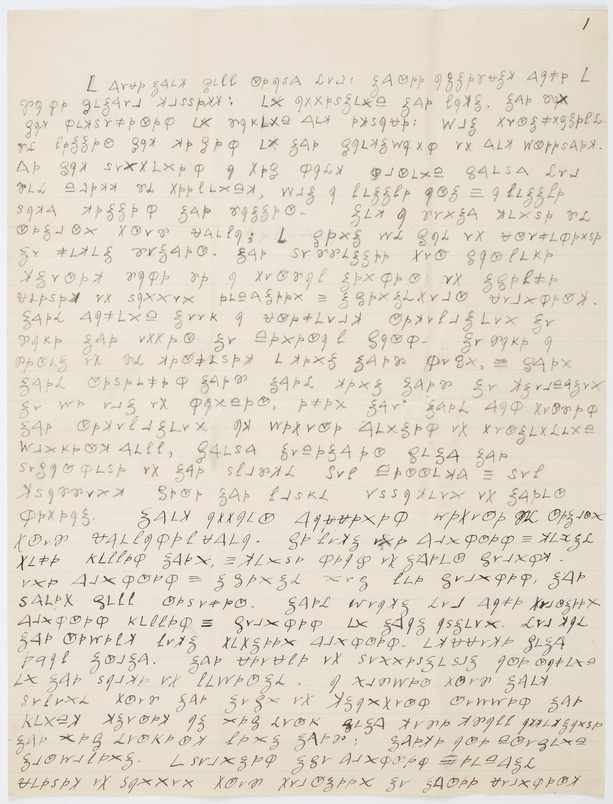

tags:: #cipher #communication #dooley #historic-developments 

---
### Reference 

Dooley, J. F. (2018). Introduction – A Revolutionary Cipher. In J. F. Dooley, _History of Cryptography and Cryptanalysis_ (pp. 1–11). Springer International Publishing. https://doi.org/10.1007/978-3-319-90443-6_1

---

### Summary & Key Take Aways

In Introduction - A Revolutionary Cipher, Dooley discusses the basic history of secret code, in addition to how these messages could be uncovered. The author begins with the story of Mary Butler's ciphered message from her lover, highlighting the use of ciphers for revolutionary purposes. Ciphers had been used for about 3000 years, providing a sense of security in communication amongst friends, family, and allies. Dooley then introduces the main topic of his article, wherein he covers the basics of encryption and decryption.
	 After this, the author explains various important definitions of types of encryption, ensuring the reader will be able to understand the terms used in future chapters. Once the main methods of encryption are solidified, Dooley discusses various methods of decrypting secret codes and ciphers, providing an insight into how militaries would decipher messages from the enemy. This chapter is a basic insight into ciphers and their history, creating the perfect pathway for Dooley to elaborate further throughout his piece.

*Dr Benjamin Church's cipher, 1775 (below)

--- 
### Links
[Privacy](Privacy.md)
